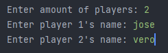
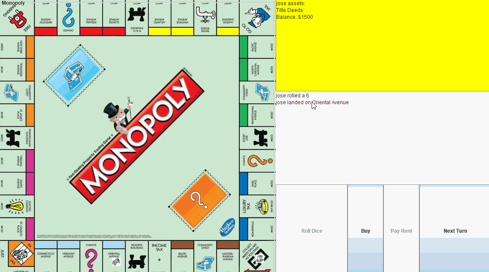
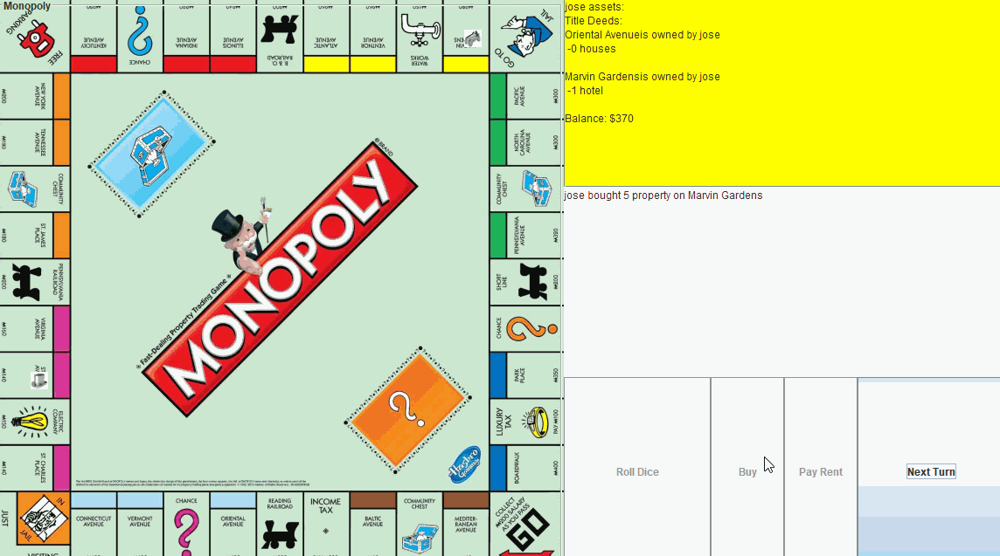

# Monopoly Game
## By: <ins> Jose Gonzalez </ins>
The project has many classes that interact with each other. The goal is to demonstrate the power
of object-oriented programming and create a simple GUI to play a friendly game of monopoly. Still need to 
add features but as of right it is playable, and you are able to win games. 

## Installation

- Clone the repository by https://github.com/josegonz115/Monopoly-Game.git

## Usage
- Simply type in the amount of players.
- Then, type in the names

- The game has options to roll dice, buy, pay rent, and advance to next turn.  
  
  
  

## Features

 

- Implemented:
    - the ability to choose amount of players
    - choose name
    - roll dice, buy, pay rent, and advance to next turn
    - there is classes made to hold cash and exchange cash when needed
    - the GUI interface that utilize many components of the java Swing toolkit

   

- Partly implemented:
    - want to add a trade feature
    - need to utilize chance and community chests
